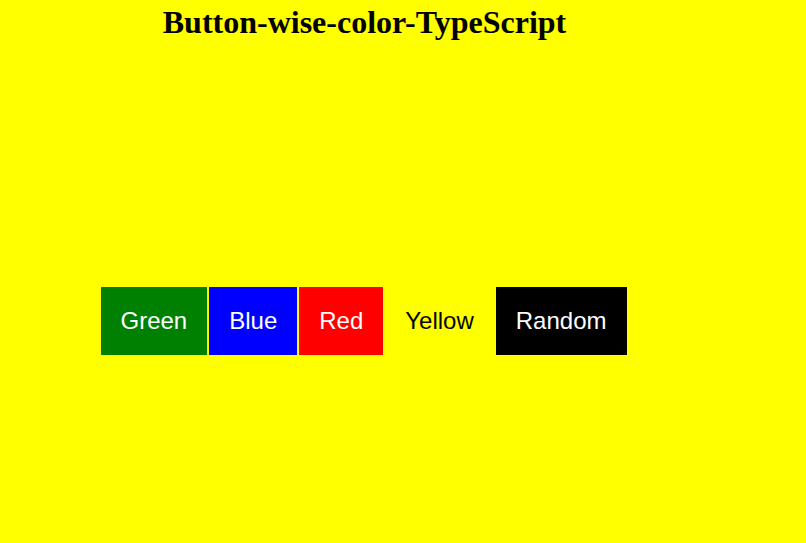
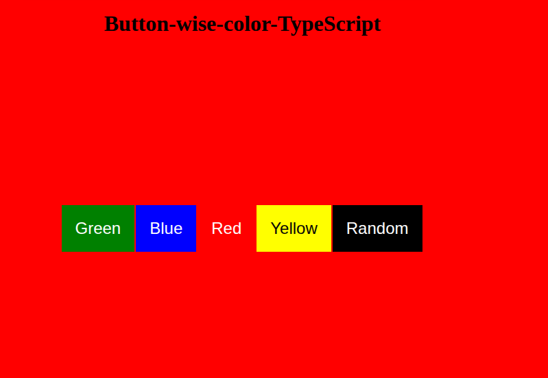
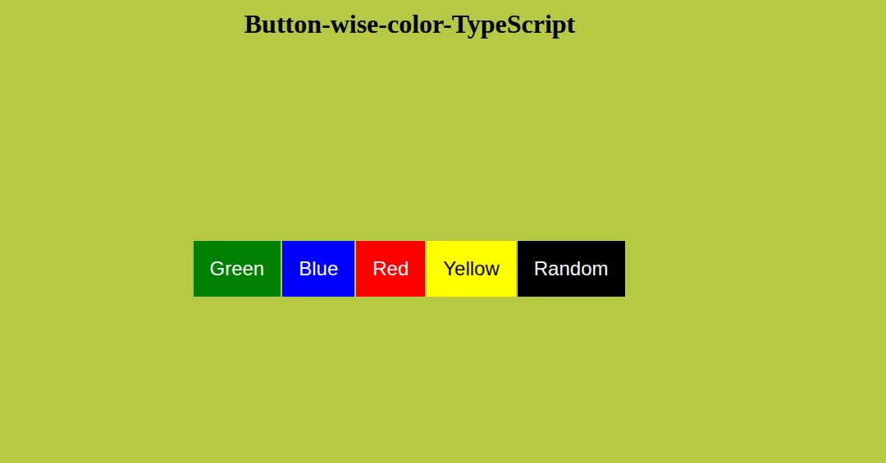

# Button-wise-color-Typescript 🎨

A simple **TypeScript-only** project that changes the background color of the page based on which button is clicked.  
This project focuses on **clean logic, proper DOM typing, and TypeScript fundamentals**.

---

## ✨ Features

- 🎯 Change background color by clicking buttons
- 🎨 Supports fixed colors: Green, Blue, Red, Yellow
- 🔀 Random RGB color generation
- 🧠 Uses event delegation for cleaner logic
- 🛡️ Type-safe DOM handling with TypeScript
- ❌ No unnecessary if-else nesting

---

## 🧠 What I Learned

- How to safely access DOM elements in TypeScript
- Why `textContent` can be `null` and how to handle it
- Difference between `includes()` and `indexOf()`
- How TypeScript catches logic issues early
- Writing clean, readable frontend logic

---

## 🛠 Tech Stack

- **TypeScript** (no direct JS writing)
- HTML
- CSS

---

## 🚀 How It Works

- A container listens for click events (event delegation)
- Button text is extracted and normalized
- Fixed colors are applied directly
- Non-fixed buttons generate random RGB colors
- Background color updates dynamically

---

## 📁 Project Structure

```
Button-wise-color-TypeScript/
│
├── src/
│   ├── script.ts            # TypeScript 
│   └── assets/
│       └── screenshot1.png   # preview image for README
│       └── screenshot2.png 
│       └── screenshot3.png                                       
├── dist/
│   └── script.js            # compiled JS
│
├── index.html               # main HTML file
├── style.css                # styling
├── tsconfig.json            # TypeScript config
├── package.json             # npm project config
├── vite.config.ts           # optional, if using Vite
└── README.md                # project README with preview + link
```


## 1️⃣ npm init
```
npm init -y
```
### 2️⃣ TypeScript install
```
npm install typescript --save-dev
```
### 3️⃣ TypeScript config generate
```
npx tsc --init
```

### 4️⃣ Compile & run
```
npx tsc --watch
```

### Create vite config file

```
touch vite.config.ts
```

[Link text](https://example.com)






[](https://yourwebsite.com)


🎯 Why This Project

This project was built to strengthen my TypeScript basics and understand how simple UI logic becomes more reliable with proper typing.

Strong developers are built from strong fundamentals.

❤️ Final Note

This is a learning-focused project, intentionally kept simple.
Clean code > Complex code.

Happy Coding 🚀